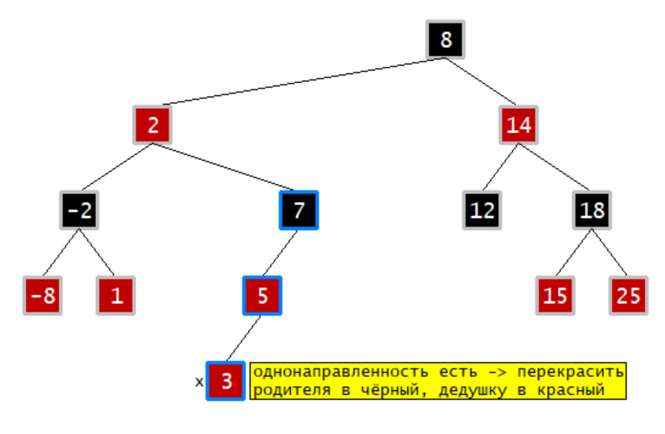
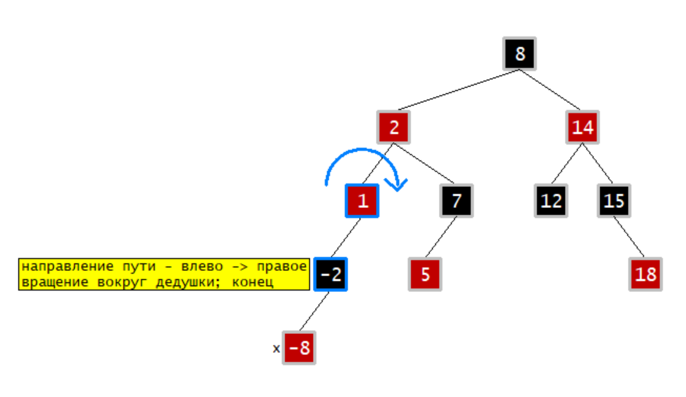
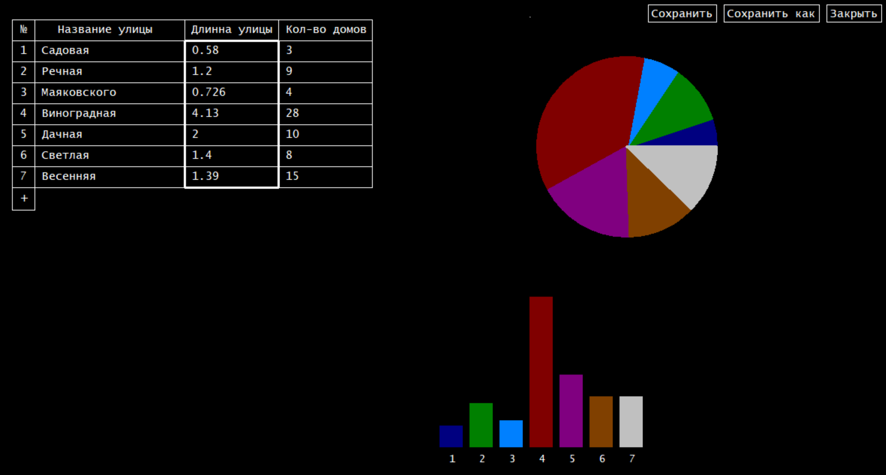

# C: структуры данных и визуализация

В репозитории содержатся учебные проекты по языку C, связанные со структурами данных, работой с памятью и простой графической визуализацией.

## Краткие описания

### Матрицы

В программе реализованы:
- различные способы хранения матриц в памяти;
- базовые операции над матрицами;
- метод Гаусса (решение систем линейных уравнений, вычисление обратной матрицы);
- вычисление матричной экспоненты.

Поддерживаются три варианта хранения матрицы:
- как массив массивов ([`matrix_a.c`](matrix/matrix_a.c);)
- как массив указателей на строки ([`matrix_b.c`](matrix/matrix_b.c));
- как одномерный массив с пересчётом индексов ([`matrix_c.c`](matrix/matrix_c.c)).

При сборке необходимо выбрать один из этих файлов реализации.

---

### Красно-чёрное дерево

Графическая визуализация операций вставки, удаления и балансировки.
Отображаются внутренние шаги алгоритмов и изменения структуры дерева.

|  |  |
| :---: | :---: |

Для графики используется библиотека [OpenBGI](http://openbgi.sourceforge.net/).  
Версию с поддержкой кириллицы можно скачать [здесь](https://csd.spbu.ru/staff/9-departament/44-ustanovka-code-blocks-mingw-i-openbgi.html).

---

### Редактор таблицы

Программа для работы с таблицей улиц (название, длина, количество домов).

Возможности:
- добавление и удаление записей;
- сортировка по выбранному столбцу;
- сохранение и загрузка из файла;
- построение простых диаграмм.

Реализована вручую вся логика интерфейса (обработка мыши, ввод, отрисовка). Тоже используется библиотека OpenBGI.

---

## Примечание

Проекты выполнены в рамках учебного курса и демонстрируют:
- работу с памятью на языке C;
- реализацию структур данных;
- разбиение программы на несколько файлов;
- базовую графическую визуализацию без использования современных фреймворков.